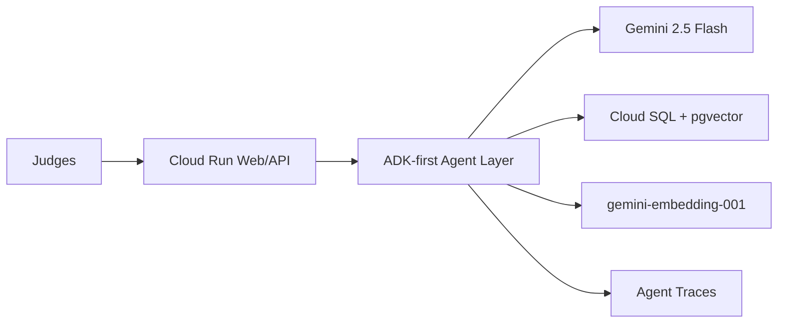

# Stormsboys AI Agents Challenge

Proyecto nuevo para preparar la entrega de Stormsboys Libros IA al Google for Startups AI Agents Challenge. Este workspace es autocontenido y no mezcla codigo, configuracion ni recursos de otros proyectos.

## Decision principal

- Estrategia de entrega: cubrir Track 1, Track 2 y Track 3 en una demo integrada.
- Track 1: nueva capa agentica ADK-first, upload de libros y agentes literarios.
- Track 2: evaluacion de calidad, guardrails, grounding y mejora before/after.
- Track 3: refactor cloud-native para Marketplace/Gemini Enterprise con roles B2B.
- Producto objetivo: plataforma multi-agente que convierte libros y catalogos editoriales en experiencias conversacionales con Gemini, RAG, memoria narrativa, modo canon, modo ficcion, voz y herramientas para lectores, publishers y superadmin.
- Entrega objetivo: demo de 1-2 minutos en ingles, arquitectura Cloud Run + Gemini + Cloud SQL/pgvector + capa ADK/Agent layer, evaluacion de calidad y documentacion tecnica clara.

## Reglas de separacion

- No copiar codigo de otros proyectos.
- La app original puede leerse como referencia del producto real, pero no se copia deuda tecnica ni configuracion antigua.
- No traer deuda tecnica conocida: secretos, credenciales demo, nombres legacy, wrappers confusos o configuraciones inconsistentes.
- No usar rutas, IDs, servicios, cuentas o datos de otros proyectos.
- Toda decision importante debe quedar documentada en `docs/adr`.

## Estructura

- `docs/product`: vision, alcance, usuario, demo y narrativa de negocio.
- `docs/agents`: diseno de agentes, herramientas, contratos y memoria.
- `docs/cloud`: arquitectura Google Cloud, despliegue y servicios.
- `docs/evaluation`: metricas, simulaciones, tests y observabilidad.
- `docs/demo`: guion, assets y checklist de submission.
- `docs/security`: seguridad, secretos, privacidad y politicas.
- `docs/adr`: decisiones tecnicas versionadas.
- `src`: codigo nuevo de API, agentes, schemas, evaluacion y demo web.
- `tests`: pruebas automatizadas del API y demo.

## Arquitectura

Diagrama para Devpost:

- `docs/submission/architecture-diagram.mmd`

Resumen:



## Primeros documentos

1. Leer `AGENTS.md`.
2. Leer `HANDOFF.md`.
3. Leer `docs/00-challenge-brief.md`.
4. Leer `docs/product/01-product-vision.md`.
5. Leer `docs/agents/01-agent-architecture.md`.
6. Leer `docs/cloud/01-target-architecture.md`.
7. Leer `docs/evaluation/01-evaluation-plan.md`.
8. Leer `docs/product/04-original-product-model.md` para entender el producto real.
9. Leer `docs/track3/01-track3-marketplace-strategy.md` para entender la estrategia Track 3.
10. Leer `docs/agents/04-platform-agent-operating-model.md` para entender la capa de agentes objetivo.
11. Leer `docs/09-real-platform-implementation-plan.md` para saber que implementar primero.
12. Leer `docs/08-original-app-track3-analysis.md` para contexto de la app original y Don Quijote.

## Estado actual

Demo publica desplegada en Google Cloud Run:

```txt
https://stormsboys-agents-api-5mpmuf566a-uc.a.run.app
```

Repositorio publico:

```txt
https://github.com/christian-eduard/stormsboys-ai-agents-challenge
```

Ya existe una API FastAPI con demo web para jueces, agente raiz ADK-first, agentes
especializados, Cloud SQL PostgreSQL con pgvector, embeddings `gemini-embedding-001`
via Vertex AI, Character Agent con `gemini-2.5-flash`, analisis Gemini-first para
manuscritos subidos, subida real de manuscritos,
trazas por agente y evaluacion before/after para Track 2.

La direccion actual es consolidar esta base como app real: upload/analisis de libros,
lector, personajes con modo canon y modo ficcion, escena/grupo, voz/narracion,
publisher dashboard y superadmin. Don Quijote se usa como caso demo principal, pero
el producto es la plataforma de catalogos interactivos.

La demo cubre:

- Dashboard de jueces con recorrido guiado para Track 1, Track 2 y Track 3.
- Lector con libro demo.
- Upload y analisis de manuscritos `.txt`, `.md` y PDFs textuales.
- Analisis literario con personajes, psicologia, escenas, lugares y constraints.
- Chat con personaje.
- Escena multi-personaje.
- Plan de voz/narracion.
- Vista publisher/admin.
- Evaluacion baseline vs optimized.
- Panel runtime con Gemini, Cloud SQL/pgvector, seed y retrieval path.

## Ejecutar Local

```bash
make setup
make test
make lint
make dev
```

En otra terminal:

```bash
BASE_URL=http://127.0.0.1:8080 make smoke
```

## Endpoints Demo

- `GET /health`
- `GET /`
- `GET /api/v1/challenge/readiness`
- `GET /api/v1/challenge/capabilities`
- `POST /api/v1/books/upload`
- `GET /api/v1/books/catalog`
- `GET /api/v1/books/{book_id}`
- `GET /api/v1/demo/book`
- `POST /api/v1/demo/chat/character`
- `POST /api/v1/demo/chat/scene`
- `POST /api/v1/demo/narration`
- `GET /api/v1/demo/publisher`
- `GET /api/v1/demo/evaluation`

## Validacion

```bash
make test
make lint
make public-ready
BASE_URL=https://stormsboys-agents-api-5mpmuf566a-uc.a.run.app make smoke
```

Ultima validacion conocida:

- Tests Docker/Python 3.11: 50 passed.
- Lint: passed.
- Public-ready scan: passed.
- Public smoke test: passed.
- Public upload smoke test: passed against Cloud SQL/pgvector.
- Public dashboard QA: `Judge journey`, 6 pasos, 3 proof cards, sin overflow horizontal.

## Estado De Implementacion

- API local y publica: implementada.
- ADK root agent: implementado.
- Agentes especializados demo: implementados.
- Evaluacion before/after: implementada con 12 casos.
- Dockerfile para Cloud Run: creado.
- Frontend demo servido por FastAPI: implementado.
- Gemini adapter central: implementado con fallback demo.
- Gemini real: activo via Vertex AI con identidad gestionada.
- Cloud Run real: desplegado.
- Cloud SQL/pgvector: activo.
- Upload real: activo en Cloud Run con catalogo, analisis y chat por `book_id`.
- Tests: 50 tests pasan en Python 3.11.
