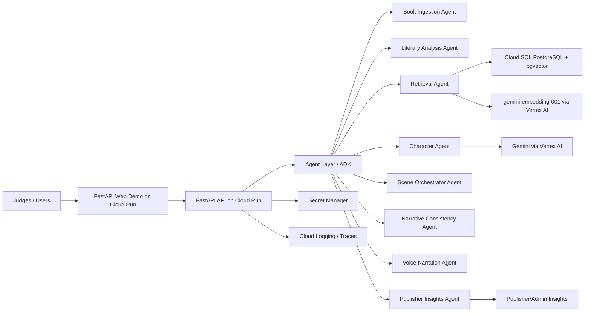

# Arquitectura Desplegada En Google Cloud

## Objetivo

Describir la demo real desplegada en Google Cloud de forma simple, defendible y alineada con Track 2.

## Arquitectura Actual

## Servicios

- Cloud Run: demo web y API FastAPI en un servicio.
- Vertex AI / Gemini: `gemini-2.5-flash` para Character Agent.
- Vertex AI Embeddings: `gemini-embedding-001` para pgvector.
- Cloud SQL PostgreSQL: datos demo y pgvector.
- Secret Manager: `DATABASE_URL` sin secretos en repo.
- Cloud Logging: runtime gestionado y trazas visibles en la demo.

## Decisiones

- Evitar GKE para la primera entrega; Cloud Run es suficiente y mas rapido.
- Usar un solo contenedor FastAPI para reducir riesgo de demo.
- Usar service account dedicada sin claves JSON de usuario.
- Separar datos demo de datos reales.
- Mantener fallback determinista local para Gemini/embeddings si no hay configuracion cloud.

## Estado Verificado

- Project ID: `stormsboys-agents-20260602`.
- Region: `us-central1`.
- Cloud Run revision activa: `stormsboys-agents-api-00013-5lk`.
- Public demo: `https://stormsboys-agents-api-5mpmuf566a-uc.a.run.app`.
- Cloud SQL/pgvector: listo.
- Embeddings: `gemini-embedding-001` via Vertex AI.
- Character generation: `gemini-2.5-flash` via Vertex AI.
- Tests: 20.

## Requisito De Demo

La demo es publica, sin credenciales, y debe mantenerse accesible para jueces hasta que se complete la evaluacion.
