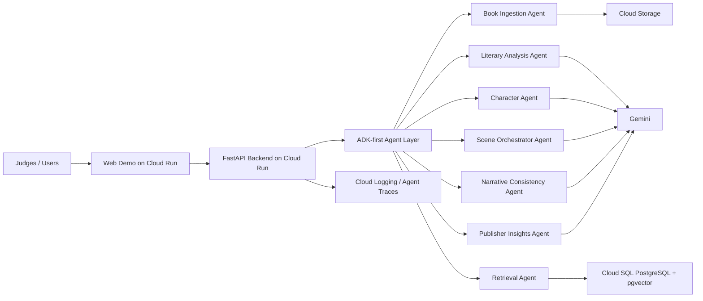

# Devpost Description Draft

## Project Name

Stormsboys AI Agents: Multi-Agent Literary Intelligence Platform

## One-Liner

Stormsboys turns books into interactive multi-agent worlds where readers can talk to characters, explore scenes, and help publishers understand narrative engagement.

## Inspiration

Digital books are still mostly passive. Readers can highlight, search, or annotate, but they cannot naturally interact with the world inside the book. We wanted to build a system where a story becomes a living environment: characters can answer from their own perspective, scenes can be explored conversationally, and publishers can understand what readers care about most.

## What It Does

Stormsboys analyzes a book with Gemini, extracts characters, places, scenes, and narrative structure, creates a grounded retrieval layer, and coordinates specialized agents for literary interaction.

The system includes:

- A Book Ingestion Agent.
- A Literary Analysis Agent.
- A Retrieval Agent.
- A Character Agent.
- A Scene Orchestrator Agent.
- A Narrative Consistency Agent.
- A Voice/Narration Agent.
- A Publisher Insights Agent.
- A Marketplace Admin console for roles, permissions, catalog operations, and platform readiness.
- A protected Author workflow that shows manuscript review, generated character agents, and approval checks.
- A protected Super Admin operations surface for runtime, tenant, quality, and governance evidence.
- A demo login flow with role-specific workspaces for Reader, Author, Publisher Admin, Super Admin, and a dedicated Judge Access account.

Readers can ask questions to a specific character, trigger multi-character scene interactions, and receive responses grounded in the book instead of generic chatbot answers.
The demo also includes a narration handoff that produces a TTS-ready script/SSML plan, plus a publisher/admin view with engagement, quality, and commercialization insights.
English is the primary submission language for judges, and the demo also includes a Spanish option for character chat so the product can serve Spanish-speaking readers.

## Track

Track 3: Refactor for Google Cloud Marketplace & Gemini Enterprise.

This submission focuses on refactoring a working agentic product concept into a Google Cloud-ready, B2B-capable platform for publishers, authors, education platforms, and enterprise reading experiences. Track 2-style evaluation remains included as quality evidence: the demo shows grounding, guardrails, before/after cases, and visible traces.

## Technical Architecture

Architecture diagram source for Devpost: `docs/submission/architecture-diagram.mmd`.

## Google Cloud Technologies

- Gemini API for analysis, reasoning, character responses, and evaluation.
- Agent Development Kit as the preferred agent architecture path.
- Cloud Run for the public judge demo and FastAPI backend.
- Cloud SQL PostgreSQL with pgvector for grounded retrieval.
- Secret Manager for sensitive configuration.
- Cloud Logging for agent observability.

## Business Case

Stormsboys targets publishers, authors, education platforms, and digital reading products. It creates new engagement layers on top of existing books, gives publishers insight into reader interests, and creates premium interactive experiences without requiring authors to rebuild their content as games or apps.
For Track 3, the demo includes a functional Marketplace Admin surface with reader, author, publisher admin, super admin, and judge access roles; a tenant-scoped publisher catalog; title availability; evaluation health; role-limited navigation; and a production identity plan based on tenant RBAC.
The public challenge build uses demo accounts, browser-local session state, and demo bearer tokens to protect publisher/admin endpoints during judging. A production Marketplace deployment would replace that layer with Identity Platform or Cloud Identity tenant-scoped RBAC.

## Innovation

The core innovation is treating a book as a coordinated multi-agent environment, not as a document attached to a chatbot. Characters have roles, constraints, emotional state, and narrative context. A consistency agent checks whether responses remain faithful to the source material. The system is designed to show before/after improvements for Track 2: fewer hallucinations, stronger character voice, better grounding, and visible execution traces.
The reader can choose between canon mode, where answers stay inside the book, and fiction mode, where the system creates a clearly separated alternative branch anchored in the original text.

## What We Built During The Challenge

This repository is a new challenge-specific implementation. It is intentionally isolated from unrelated projects and avoids reused secrets, legacy configuration, or cross-project dependencies.

## Demo Access

- Demo URL: https://stormsboys-agents-api-5mpmuf566a-uc.a.run.app
- Demo username: not required.
- Demo password: not required.
- Runtime: Cloud Run, Vertex/Gemini, Cloud SQL PostgreSQL, pgvector, and Secret Manager are active in the deployed demo.
- Known limitations: the demo uses a controlled sample book rather than arbitrary uploads. Retrieval uses Cloud SQL pgvector with Gemini embeddings through Vertex AI, and the app keeps a deterministic local fallback for resilience.
